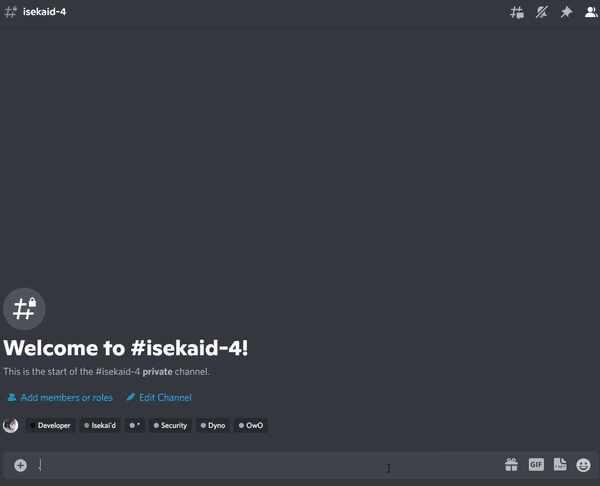
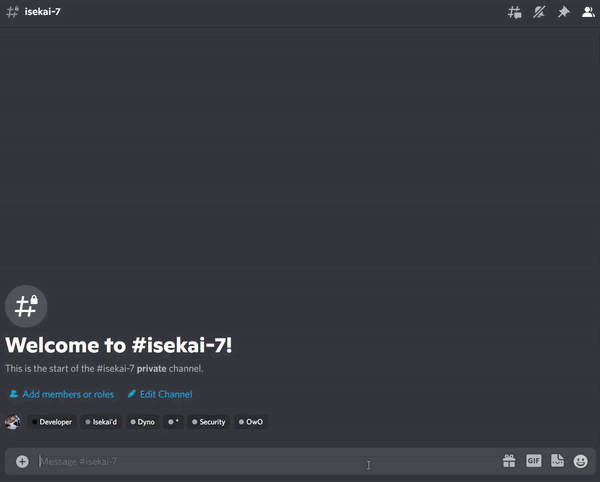

# Battling 

## Maps
Maps are locations that let you battle monsters to obtain gold and experience. Experience can be used to level up. Each room give you more coins and experience but have stronger monsters. Each room has a level requirement.

## Battling monsters
To fight monsters, type `$map` to view maps. Use the left and right arrows to navigate across unlocked maps. Press the A key to fight a monster. Upon accepting, you must type the number according to your learnt skills to either deal damage or deal buffs or debuffs. 

## Drops and levelling
Defeating monsters give you experience and gold. There is also a chance to drop equipment. Equipment can be more frequent and have a higher rarity at higher maps.

Levelling up from experience gives you **5 stat points**. Stat points can be used to buff up your base stats:

* health - total hitpoints
* strength - increases damage dealt for strength attackers
* defense - reduces damage taken
* intelligence - increases damage dealt for intelligence attackers
* dexterity - speed, used for move priority

To add stat points use the command `$stat {stat type} {no. of stat points}.

You can use gold to buy items from the shop! Use `$shop` to view available items. Use `$buy {item}` to buy an item.

## Battling Players

Isekai'd provides a 1v1 battle option for players. You can duel a player using `$duel {player}`. The player can then choose their moves. If dexterity for both players are the same, then the sender will get priority.

## Demonstration
!!! example

    === "Battles"
        

    === "Stat Points"

        
        
